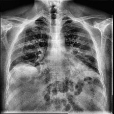
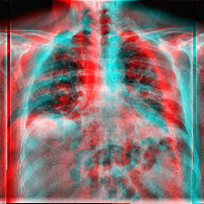

# 2D vs 3D Deep Learning Comparison

## Overview
This project compares performance between 2D and 3D deep learning models for image classification.

In addition, 2D images are transformed into 3D representations using a **2D-to-3D stereoscopic conversion technique**, enabling a fair comparison between 2D and pseudo-3D inputs.

## Methodology

### 2D to 3D Conversion
To simulate 3D data from 2D images, this project applies a **stereoscopic transformation approach**, where depth perception is approximated by generating multiple perspectives from a single 2D image.

This allows:
- Enhanced spatial feature representation
- Improved depth-related learning capability
- Better performance comparison between 2D and 3D pipelines

## Models
- EfficientNet
- ResNet
- Vision Transformer (ViT)

## Results
- 3D models outperform 2D models
- EfficientNet achieved highest accuracy
- Grad-CAM used for explainability

## Dataset
⚠️ Dataset is not included due to size limitations.

## Sample Data

These are example preprocessed images used in the pipeline:

| Sample 1 | Sample 2 |
|---|---|
|  |  |

## Tools
- PyTorch
- OpenCV
- Ultralytics YOLO (for detection tasks)
